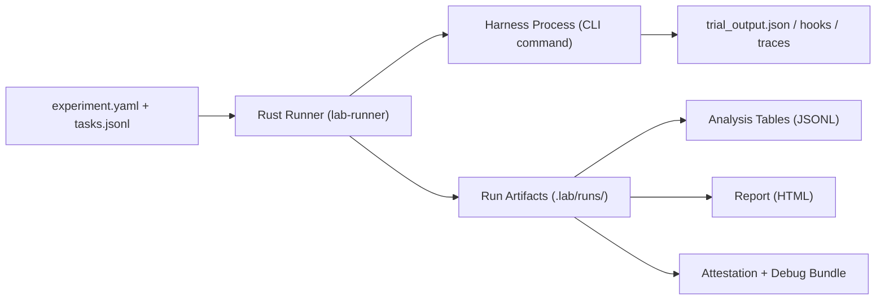

# AgentLab (Prototype)

AgentLab is an experiment runner for agent/trainer systems with:
- dataset-driven trials (`tasks.jsonl`)
- explicit A/B variant plans
- isolation-aware execution (container/local modes)
- reproducible run artifacts under `.lab/runs/<run_id>/`
- analysis tables + report output
- provenance/debug bundle artifacts

## Architecture

Core execution shape:



Mental model:
- Runner writes `trial_input.json` per trial.
- Harness consumes input and writes `trial_output.json`.
- Optional `harness_manifest.json` and `harness_events.jsonl` increase interpretability.
- Analysis and report are built from run artifacts, not ad-hoc logs.

---

## Rust CLI (Primary Runtime)

The Rust CLI (`lab-cli`) is the primary execution engine.

### Build

```bash
git clone <agentlab-repo>
cd <agentlab-repo>/rust
cargo build -p lab-cli --release
```

Use from a harness repo:

```bash
ln -sf /path/to/agentlab/rust/target/release/lab-cli ./lab
./lab --help
```

Prerequisites:
- Docker daemon running (for container mode)
- harness entry command exists in repo
- container image available or buildable

### First Run (Harness Repo)

1. Initialize:

```bash
./lab init
```

2. Edit the generated experiment file — fill in all fields marked `REQUIRED`:

```bash
$EDITOR .lab/experiment.yaml
```

3. Validate resolved config:

```bash
./lab describe .lab/experiment.yaml
```

Optional knob registry:

```bash
./lab knobs-init
./lab knobs-validate
./lab describe .lab/experiment.yaml --overrides .lab/knobs/overrides.json
```

4. Dev run (runtime dependency install):

```bash
./lab run-dev .lab/experiment.yaml --overrides .lab/knobs/overrides.json --setup "<install command>"
```

`<install command>` examples:
- Bun: `bun install --frozen-lockfile`
- npm: `npm ci`
- pnpm: `pnpm install --frozen-lockfile`
- yarn: `yarn install --frozen-lockfile`
- uv: `uv sync --frozen`
- pip: `pip install -r requirements.txt`

5. Experiment run (strict network-none posture):

```bash
./lab run-experiment .lab/experiment.yaml --overrides .lab/knobs/overrides.json
```

### Command Semantics

- `run-dev`: effective network mode `full`, faster iteration.
- `run-experiment`: requires effective network mode `none`.
- `knobs-init`: writes `.lab/knobs/manifest.json` + `.lab/knobs/overrides.json`.
- `knobs-validate`: validates override IDs/types/ranges/options.
- `clean --init`: removes init files.
- `clean --runs`: removes run directories.

### JSON Machine Mode (SDK/UI Contract)

Core commands support `--json` and emit one JSON object:

```bash
./lab describe .lab/experiment.yaml --json
./lab run-dev .lab/experiment.yaml --overrides .lab/knobs/overrides.json --json
./lab run-experiment .lab/experiment.yaml --overrides .lab/knobs/overrides.json --json
./lab publish --run-dir .lab/runs/<run_id> --json
```

Success envelope:

```json
{ "ok": true, "command": "describe", "summary": { "...": "..." } }
```

Error envelope:

```json
{ "ok": false, "error": { "code": "command_failed", "message": "...", "details": {} } }
```

### Workload Types

Supported:
- `agent_harness`
- `trainer`

Set `experiment.workload_type` in `experiment.yaml`.

Trainer output expectations:
- `trial_output.objective`: `name`, `value`, optional `direction`
- `trial_output.metrics`: secondary metrics (`train_loss`, `val_acc`, `wall_time_s`, etc.)
- optional `trial_output.checkpoints`

These flow to:
- `analysis/tables/trials.jsonl`
- `analysis/tables/metrics_long.jsonl`

### Pathing and Troubleshooting

Pathing:
- `runtime.harness.command` resolves from harness project root.
- If experiment is `.lab/experiment.yaml`, project root is parent of `.lab`.
- `describe` prints `harness_script_resolved` and `harness_script_exists`.

Common failures:
- `harness command file not found`:
  - fix `runtime.harness.command` in `.lab/experiment.yaml`
  - rerun `./lab describe .lab/experiment.yaml`
- dependency/native module errors in container:
  - use `run-dev` + proper `--setup` install command
  - or bake dependencies into image and use `run-experiment`
- missing trial output:
  - runner writes fallback `trial_output.json` with `harness_process_error`

### Analytics (DuckDB)

Per run tables:
- `.lab/runs/<run_id>/analysis/tables/trials.jsonl`
- `.lab/runs/<run_id>/analysis/tables/metrics_long.jsonl`
- `.lab/runs/<run_id>/analysis/tables/event_counts_by_trial.jsonl`
- `.lab/runs/<run_id>/analysis/tables/event_counts_by_variant.jsonl`
- `.lab/runs/<run_id>/analysis/tables/variant_summary.jsonl`
- `.lab/runs/<run_id>/analysis/tables/load_duckdb.sql`

Quick load:

```bash
cd .lab/runs/<run_id>/analysis
duckdb agentlab.duckdb < tables/load_duckdb.sql
```

---

## TypeScript SDK (`@agentlab/sdk`)

The SDK provides a programmatic interface for building experiments and driving the Rust runner. Define experiments with a fluent builder, execute via a typed client, and get structured JSON results — no YAML hand-editing required.

Local package path: `sdk/` — see [`sdk/README.md`](sdk/README.md) for full API reference.

```bash
cd sdk
npm install
npm run build
npm test
```

### Build + Run Example

```ts
import { ExperimentBuilder, LabClient } from '@agentlab/sdk';
import { writeFileSync, mkdirSync } from 'node:fs';

// Build an experiment spec
const builder = ExperimentBuilder.create('prompt_ab', 'Prompt A/B Test')
  .description('Compare prompt v1 vs v2 on coding tasks')
  .datasetJsonl('tasks.jsonl', { suiteId: 'coding', splitId: 'dev', limit: 50 })
  .harnessCli(['node', './harness.js', 'run'], { integrationLevel: 'cli_events' })
  .sanitizationProfile('hermetic_functional_v2')
  .replications(3)
  .randomSeed(1337)
  .baseline('control', { prompt: 'prompt:v1' })
  .addVariant('treatment', { prompt: 'prompt:v2' })
  .primaryMetrics(['success', 'accuracy'])
  .networkMode('allowlist_enforced', ['api.openai.com']);

// Write YAML to disk
mkdirSync('.lab', { recursive: true });
writeFileSync('.lab/experiment.yaml', builder.toYaml());

// Execute
const client = new LabClient();
const summary = await client.describe({ experiment: '.lab/experiment.yaml' });
console.log(`${summary.summary.total_trials} trials planned`);

const run = await client.runExperiment({ experiment: '.lab/experiment.yaml' });
console.log(`Run complete: ${run.run.run_id}`);
```

### Client Commands

| Method | Description |
|---|---|
| `client.describe(args)` | Experiment summary without execution |
| `client.run(args)` | Run experiment (optional container mode) |
| `client.runDev(args)` | Development run with optional setup command |
| `client.runExperiment(args)` | Strict run with network isolation |
| `client.publish(args)` | Create debug bundle from a run |
| `client.validateKnobs(args)` | Validate parameter overrides against manifest |
| `client.validateHooks(args)` | Validate event stream against harness manifest |
| `client.validateSchema(args)` | Validate JSON file against a schema |

All commands throw `LabRunnerError` on failure with structured `code`, `message`, `details`, `exitCode`, `stderr`, and `command` fields.

### Runner Discovery

`LabClient` resolves the runner binary in order:
1. `runnerBin` constructor option
2. `AGENTLAB_RUNNER_BIN` environment variable
3. `lab` (assumes on `PATH`)
